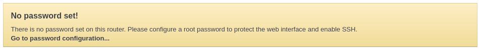

# Carambola 2

# Setup

1. Plug in a USB to mini USB cable a 5V 0.5A power supply
2. Plug in a ethernet cable to J4 - ETH1 LAN port.
   
   Note: Computer used to setup the Carambola must be on the same local network
3. Carambola should now appear on your local network at `192.168.1.1`. So a) the LAN must be on `192.168.1.0/24` CIDR block, b) must have IP `192.168.1.1` free.
4. Go to [luci](http://192.168.1.1/luci) and click on "Go to password configuration" 
   setup a password for root
5. SSH & SCP server with Dropbear setup. Disable "Password authentication" & "Allow root logins with password"
6. Set an ssh key

## Reference

https://www.8devices.com/wiki/carambola2:userguide
